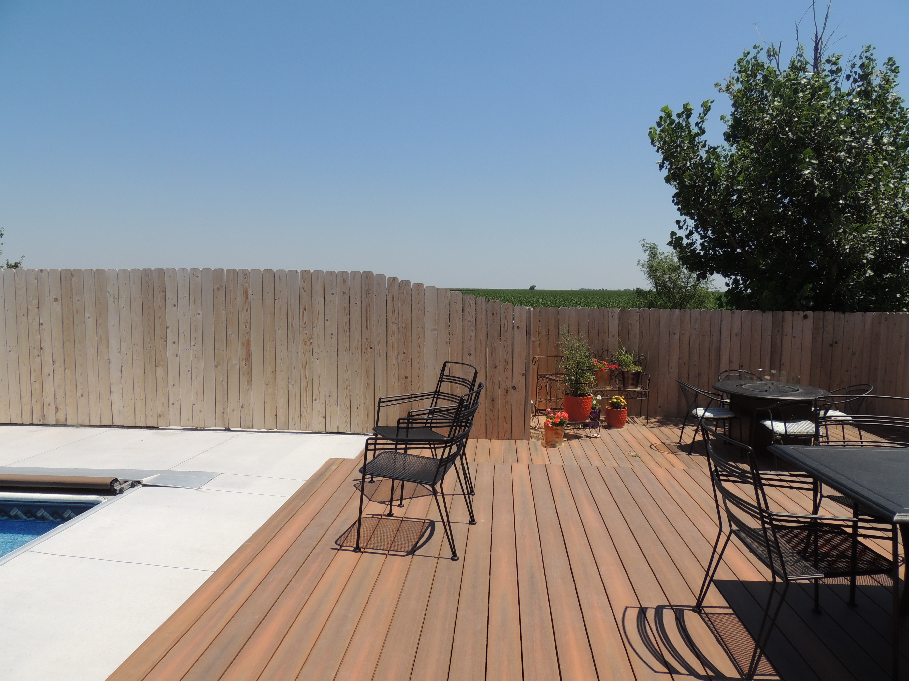

Our wooden privacy fences are constructed to the highest standards. From the ground up, we dig out an area for a footer, build forms, pour concrete, and set posts. We use three cross beams to prevent warping of the pickets.

Pickets are spaced evenly apart to give a uniform look. Decking screws are used instead of nails to promote a long-lasting fence.
